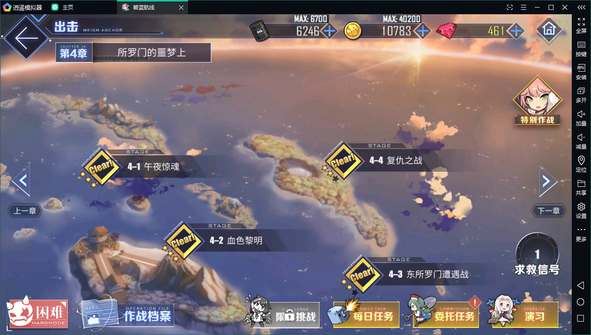
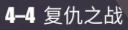

# AzurLaneScripts

碧蓝航线的自动刷图脚本.

tips_1: 电脑需要安装python运行环境.
 
tips_2: 需要配合 安卓模拟器(推荐)/手机 使用.

tips_3: 这里仅讨论windows平台的使用.

tips_4: 默认读者已经有一定的动手能力.

tips_5: 脚本还在完善中, 配置运行方式都可能会(向着更简便的方式)改变.

## 使用方法

原理是通过ADB对手机屏幕截图, 对比模板图片判断当前游戏情况, 然后通过ADB模拟点击/拖拽等操作.

### 环境搭建

#### 安装python

前往 [miniconda](https://docs.conda.io/en/latest/miniconda.html) 下载 python 3.7 安装包并安装.

安装时注意配置运行环境(path).

    如何判断python安装成功?
    
    打开cmd, 执行 `python --version`, 如果正确显示python版本号则说明安装成功

#### 安装python依赖

需要用户手动安装cv2, 用来处理图像相关的工作.

    pip install opencv-python

#### 关于ADB和设备

本项目已经自带了adb.exe程序. 用户不必再手动下载.

许多安卓模拟器也会自带adb程序, 不过其自带的版本往往比较低, 一些功能残缺.

+ 如果发现在运行时提示找不到设备, 则可以尝试将项目自带的ADB软件覆盖到模拟器中ADB相应的位置. 然后重启虚拟机，即可自动连接。(逍遥模拟器测试可行)
+ 如果上述方法不能解决问题，则需要用户去网上查找当前模拟器的ADB连接端口。然后修改本项目中的配置文件 `config.ini` 中 `adb_host_port` 配置。
+ 如果提示设备过多, 则可能虚拟机有多开的情况, 或者是虚拟机和手机同时连接了. 请断开多余设备.

##### 模拟器使用分享

不同的模拟器在ADB的实现细节上不同，游戏的体验上也不同。下表是近期（2020-03）的一些体验。欢迎体验的小伙伴贡献经验。

| 模拟器 | ADB端口 | ADB自动连接 | 游戏体验 | 备注（CPU等资源占用情况）    |
| ------ | ------- | ----------- | -------- | ---------------------------- |
| 雷电   | 5555    | √           | 3.5      | 占用未注意，掉帧相对严重     |
| 逍遥   | 21503   | ×           | 4.5      | 占用相对较低，偶尔会卡死     |
| MUMU   | 7555    | ×           | 4        | 占用和逍遥接近，声称不会卡死 |
| 夜神   | 62001   |             |          |
| 蓝叠   | 5555    |             |          |
| 天天   | 5037    |             |          |

> 注：游戏体验是指运行是否流畅，掉帧是否严重等情况。1~5分，分数越高体验相对越好。打分全凭个人感受。

> 注：模拟器卡顿掉帧并不一定是模拟器的问题，这游戏优化本来就不太好。在我安卓手机上（小米Note3）运行也跟雷电模拟器一样，60帧开起来跟没开一样。

### 运行

打开游戏，进入关卡界面。比如：

如果你想自动刷**4-4**关卡，则将**4-4**的关卡截一个图放到 `temp_images/target-stage` 下，如：

然后运行 `Fight.py` 或 `FightCycle.py`：

+ Fight.py 只会在“已经处于某个关卡中”时才会进行战斗，战斗至关卡结束就会停止
+ FightCycle.py 会根据 target_stage 目录下的模板文件寻找关卡，一直战斗。除非遇到“船坞满员”，“没油”等情况。

这两个脚本都会自动判断是否已经在关卡中（寻敌界面），如果在就会立刻开始寻敌。因此用户可以手动点进一些特殊关卡，然后运行 `Fight.py` 用来通关。

**自动退役**

请务必注意这项配置！！可能某些使用者不需要！！

配置文件 `config.ini` 中有一个配置项：`auto_retire`（自动退役），默认是**True**。在遇到船坞满员时，会进行“一键退役”功能。此时退役的船取决于碧蓝航线的自动推荐。退役完成后会继续执行战斗。

发现新船时会进行锁定，因此不必担心新船被退役。
